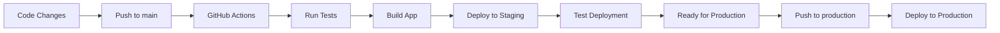

# 🎉 GitHub Deployment Setup Complete!

Your SecureContract Pro application is now configured for **automated deployment from GitHub to Google Cloud Platform**. You can now deploy from any machine by simply pushing code to GitHub!

## 🚀 What's Been Set Up

### ✅ GitHub Actions Workflows
- **Staging Deployment**: Automatic deployment on push to `main` branch
- **Production Deployment**: Manual deployment to `production` branch
- **Testing Pipeline**: Automated tests before every deployment
- **Environment Separation**: Different configs for staging vs production

### ✅ Environment Configurations
- **Staging**: Devnet, debug enabled, cost-optimized scaling
- **Production**: Mainnet-Beta, production-ready, performance-optimized
- **Security**: All secrets managed via Google Secret Manager
- **Monitoring**: Comprehensive logging and health checks

### ✅ New Files Created
```
.github/workflows/
├── deploy-to-gcloud.yml      # Main deployment workflow
└── deploy-production.yml     # Production deployment workflow

Environment Configs:
├── app.staging.yaml          # Frontend staging config
├── app.production.yaml       # Frontend production config
├── backend/app.staging.yaml  # Backend staging config
└── backend/app.production.yaml # Backend production config

Scripts:
├── scripts/setup-github-deployment.sh  # GitHub integration setup
└── cloudbuild-trigger.yaml            # Cloud Build configuration
```

## 🚀 How to Deploy (Super Simple!)

### 1. **One-Time Setup** (Run once)
```bash
# Setup GitHub integration
./scripts/setup-github-deployment.sh

# Setup Google Cloud secrets
./scripts/setup-gcloud-secrets.sh
```

### 2. **Add GitHub Secrets** (One-time)
Go to: `https://github.com/YOUR_USERNAME/YOUR_REPO/settings/secrets/actions`

Add these secrets (provided by setup script):
- `GCP_PROJECT_ID`
- `GCP_SA_KEY`

### 3. **Deploy to Staging** (Every time you want to deploy)
```bash
git add .
git commit -m "Your changes"
git push origin main
```
**That's it!** Your app automatically deploys to staging.

### 4. **Deploy to Production** (When ready for live)
```bash
git checkout production
git merge main
git push origin production
```

## 🌐 Your Application URLs

After deployment, your app will be available at:

### Staging Environment (Devnet)
- **Frontend**: `https://YOUR_PROJECT_ID.uc.r.appspot.com`
- **Backend**: `https://backend-dot-YOUR_PROJECT_ID.uc.r.appspot.com`
- **Health Check**: `https://backend-dot-YOUR_PROJECT_ID.uc.r.appspot.com/api/health`

### Production Environment (Mainnet-Beta)
- **Frontend**: `https://YOUR_PROJECT_ID.uc.r.appspot.com`
- **Backend**: `https://backend-dot-YOUR_PROJECT_ID.uc.r.appspot.com`
- **Health Check**: `https://backend-dot-YOUR_PROJECT_ID.uc.r.appspot.com/api/health`

## 🔄 Deployment Workflow



## 📊 Environment Differences

| Feature | Staging | Production |
|---------|---------|------------|
| **Solana Network** | Devnet (Free SOL) | Mainnet-Beta (Real SOL) |
| **Debug Mode** | Enabled | Disabled |
| **Logging Level** | Debug | Info |
| **Scaling** | 0-5 instances | 1-20 instances |
| **Purpose** | Testing & Development | Live Application |
| **Auto-Deploy** | ✅ On push to main | ❌ Manual only |

## 🎯 Available Commands

### NPM Scripts
```bash
npm run github:setup        # Setup GitHub deployment
npm run deploy:staging      # Deploy to staging (git push origin main)
npm run deploy:production   # Deploy to production (git push origin production)
npm run gcloud:setup        # Setup Google Cloud secrets
```

### Git Commands
```bash
# Deploy to staging
git push origin main

# Deploy to production
git checkout production
git merge main
git push origin production

# Check deployment status
# Go to: https://github.com/YOUR_USERNAME/YOUR_REPO/actions
```

## 🔐 Security Features

### ✅ Secrets Management
- All sensitive data in Google Secret Manager
- No secrets in code or GitHub repository
- Automatic secret rotation support
- IAM-based access control

### ✅ Environment Isolation
- Separate staging and production environments
- Different Solana networks (Devnet vs Mainnet)
- Independent scaling and configuration
- Isolated databases and resources

### ✅ Deployment Security
- Service account with minimal permissions
- Encrypted communication (HTTPS only)
- Security headers implemented
- Rate limiting and input validation

## 📈 Monitoring & Observability

### GitHub Actions
- **Real-time Status**: View deployment progress
- **Detailed Logs**: Debug any issues
- **PR Comments**: Automatic deployment notifications
- **Release Management**: Automatic GitHub releases

### Google Cloud Console
- **App Engine Dashboard**: Instance health and performance
- **Cloud Logging**: Centralized log management
- **Cloud Monitoring**: Custom metrics and alerts
- **Error Reporting**: Automatic error tracking

## 💰 Cost Optimization

### Estimated Monthly Costs
- **Staging**: $5-15 (minimal usage, auto-scales to 0)
- **Production**: $20-100 (depends on traffic)
- **Free Tier**: 28 instance hours/day included

### Cost-Saving Features
- Auto-scaling with min_instances: 0 for staging
- Efficient build process
- CDN for static assets
- Pay-per-use pricing model

## 🧪 Testing & Quality Assurance

### Automated Testing (Every Deployment)
- ✅ ESLint code quality checks
- ✅ Frontend build validation
- ✅ Backend dependency verification
- ✅ Deployment smoke tests
- ✅ API health checks

### Manual Testing Checklist
After each deployment:
- [ ] Frontend loads correctly
- [ ] Backend API responds
- [ ] Wallet connection works
- [ ] Contract creation functions
- [ ] Email notifications send
- [ ] Network switching works

## 🚨 Troubleshooting

### Quick Fixes
```bash
# Check deployment status
# Go to: https://github.com/YOUR_USERNAME/YOUR_REPO/actions

# View application logs
gcloud app logs tail -s default
gcloud app logs tail -s backend

# Test API health
curl https://YOUR_PROJECT_ID.uc.r.appspot.com/api/health

# Re-run setup if needed
./scripts/setup-github-deployment.sh
```

### Common Issues
1. **GitHub Actions failing**: Check secrets are correctly set
2. **Build errors**: Verify dependencies and environment variables
3. **Deployment timeouts**: Normal for first deployment (5-10 minutes)
4. **API errors**: Check Google Cloud secrets are accessible

## 🎊 Benefits of GitHub Deployment

### ✅ **Multi-Machine Development**
- Deploy from any computer with git access
- No need to install Google Cloud CLI locally
- Consistent deployment process across team

### ✅ **Automated CI/CD**
- Automatic testing before deployment
- Consistent build and deployment process
- Rollback capabilities with version history

### ✅ **Environment Management**
- Separate staging and production environments
- Safe testing before production deployment
- Environment-specific configurations

### ✅ **Collaboration Ready**
- Team members can deploy with git push
- Pull request integration
- Deployment status in GitHub

## 📚 Documentation

- **Complete Guide**: `GITHUB_DEPLOYMENT_GUIDE.md`
- **Google Cloud Guide**: `GOOGLE_CLOUD_DEPLOYMENT_GUIDE.md`
- **Setup Summary**: `GOOGLE_CLOUD_SETUP_COMPLETE.md`

## 🎯 Next Steps

### Immediate Actions
1. **Run the setup script**: `./scripts/setup-github-deployment.sh`
2. **Add GitHub secrets** as instructed
3. **Push to main branch** to trigger first deployment
4. **Test staging environment** thoroughly
5. **Deploy to production** when ready

### Advanced Configuration
1. **Custom Domain**: Configure your own domain name
2. **Monitoring Alerts**: Set up custom alerts and dashboards
3. **Performance Optimization**: Implement caching strategies
4. **Team Access**: Add team members to GitHub repository

## 🎉 Congratulations!

Your SecureContract Pro application now has **enterprise-grade CI/CD deployment** with:

- 🚀 **One-command deployment** (git push)
- 🔒 **Enterprise security** with secrets management
- 📊 **Full observability** and monitoring
- 💰 **Cost-optimized** auto-scaling
- 🌍 **Multi-environment** support (staging/production)
- 👥 **Team collaboration** ready

**Ready to deploy? Just run the setup script and push your code!**

```bash
./scripts/setup-github-deployment.sh
git push origin main
```

**Your app will be live in minutes! 🎊**
